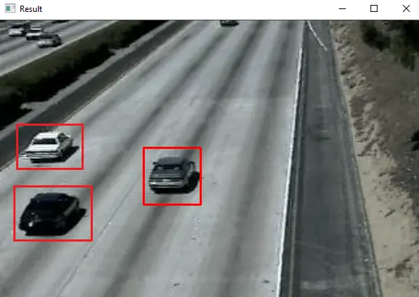

# Real-Time Car Detection using OpenCV and Python With Source Code

### Overview
The Real-Time Car Detection OpenCV Python project was developed using Python and OpenCV. Vehicle detection is a widely used feature by companies and organizations these days. This technology uses computer vision to detect different types of vehicles in a video or real-time via a camera.

A Car Detection OpenCV Python project finds its applications in traffic control, car tracking, creating parking sensors, and many more. In this project, we will learn how to build a car tracking system in Python for both recorded and live cam streamed videos.

### Features
- Real-time vehicle detection
- Application in traffic control
- Car tracking capability
- Creation of parking sensors

### Project Structure
- License: Contains the license information for the project.
- README.md: This file, providing an overview and details of the project.
- data/
    - Video1.avi: Another sample video file.
    - video2.avi: Additional sample video file.
    - video3.mp4: Sample video file for detection.
- cars.xml: Haarcascade file for car detection.
- main.py: The main Python script to run the car detection system.
- requirements.txt: File listing the dependencies required to run the project.

### Installation and Usage
1.- Clone the repository to your local machine.

git clone https://github.com/TeranGit/car-detection.git

2.- Navigate to the project directory.

3.- Install the required dependencies.

pip install -r requirements.txt

4.- Run the main script.

python main.py

### Summary
Car detection is one of the widely used features by companies and organizations these days. This technology uses computer vision to detect different types of vehicles in video or in real time via a camera. It finds its applications in traffic control, car tracking, creating parking sensors, and many more.

### Inquiries
If you have any questions or suggestions about Real-Time Car Detection OpenCV Python With Source Code, please feel free to leave a e-mail frubengarcia@gmail.com

### Acknowledgements
Special thanks to:

- The OpenCV community for providing extensive libraries and documentation.
- The contributors who helped in testing and debugging the project.
- All the users and developers who provide valuable feedback and suggestions.
